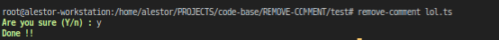

<h1 align=center>REMOVE-COMMENT</h1>

> This is a simple code for removing all comments

<p align=center>

<a href="https://github.com/alestor123/REMOVE-COMMENT/issues">
</a>

<a href="https://www.npmjs.com/package/remove-comment"></a>
</p>
<p align=center>
<a href="https://npmjs.org/package/remove-comment">
</a>
</p>

## 🚀 Usage

## API

```
const removeComment = require('./App')
removeComment(['./test/'])
```

## Quick use
```
$ npx remove-comment <output file or directory paths>
```
## CLI Installation
```
$ npm install -g remove-comment
```
```
$ remove-comment <output file or directory paths>
```
# Screenshots    




## 💖 [Donate](https://alestor123.is-a.dev/donate)


## Author

👤 **Alestor Aldous**

- Twitter: [@alestor123](https://twitter.com/alestor123)
- Github: [@alestor123](https://github.com/alestor123)


## 📝 License
> MIT

Copyright © 2022 [Alestor Aldous](https://github.com/alestor123).<br />